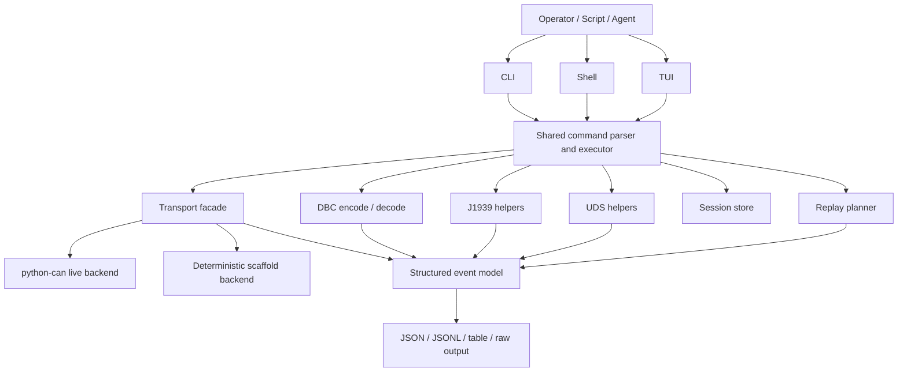
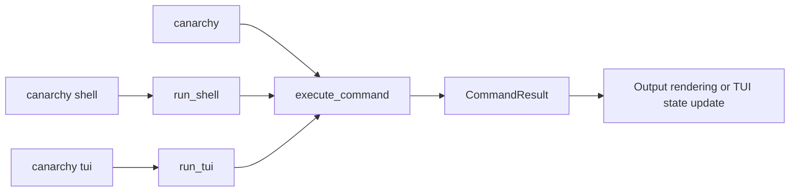
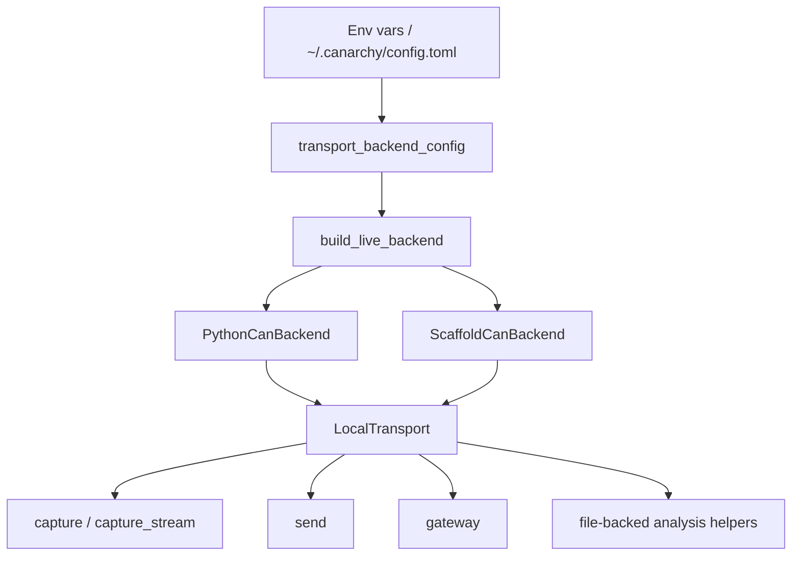
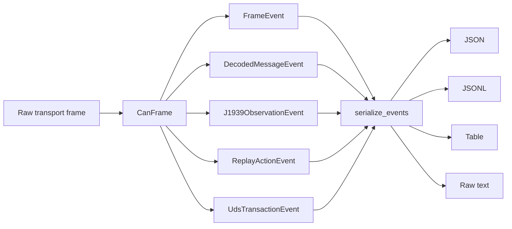
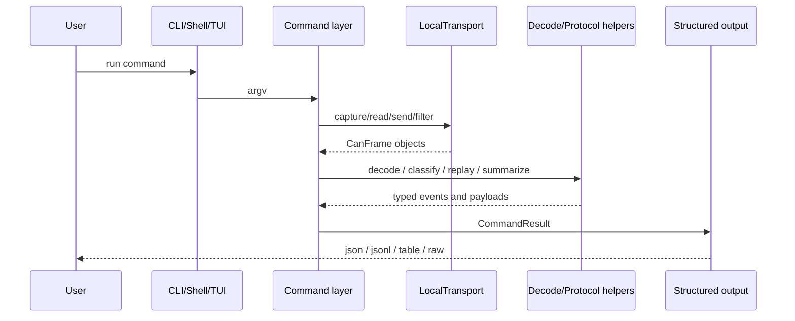

# Architecture

## Overview

CANarchy is a CLI-first CAN analysis toolkit built around one core rule:

> The CLI is the contract. The shell and TUI are views over the same command and event path.

The current implementation is Python-based and uses `uv` for dependency management, virtual environments, and packaging workflows.

The codebase is organized around four practical layers:

1. core models and protocol helpers
2. transport and backend selection
3. command execution and output shaping
4. front ends that reuse the same command path

Important current-state note: live bus integration currently builds on `python-can`. CANarchy does not try to replace hardware abstraction itself; it adds a higher-level workflow, protocol, and structured-output layer on top.

## System View

## Layering

### 1. Core Model And Protocol Layer

This layer is responsible for the typed data model that everything else builds on.

Primary responsibilities:

* `CanFrame` validation and serialization
* typed event objects such as `frame`, `decoded_message`, `signal`, `j1939_pgn`, `uds_transaction`, `replay_event`, and `alert`
* J1939 arbitration ID decomposition and higher-level observation helpers
* DBC encode and decode helpers
* replay planning from captured timestamps
* session context and persistence helpers

Relevant modules:

* `src/canarchy/models.py`
* `src/canarchy/j1939.py`
* `src/canarchy/dbc.py`
* `src/canarchy/replay.py`
* `src/canarchy/session.py`
* `src/canarchy/uds.py`

This layer should remain reusable without depending on any specific front end.

### 2. Transport And Backend Layer

This layer is responsible for moving raw CAN frames in and out of the system.

Primary responsibilities:

* selecting the active backend from environment or config
* reading and writing live CAN frames
* parsing file-backed capture input such as `candump`
* exposing a stable local transport facade to the command layer
* keeping live and deterministic transport behavior behind one interface

Relevant module:

* `src/canarchy/transport.py`

Current backend model:

* `python-can` backend for live bus access
* scaffold backend for deterministic development and testing flows

### 3. Command Layer

This layer is the main application surface.

Primary responsibilities:

* command definitions and subcommands
* argument parsing and validation
* dispatch to transport, protocol, replay, and session helpers
* structured error handling and exit codes
* shaping output for `--json`, `--jsonl`, `--table`, and `--raw`

Relevant module:

* `src/canarchy/cli.py`

The command layer is the authoritative behavior contract for the project.

### 4. Front Ends

The project currently ships three front-end entry styles:

* CLI: non-interactive and authoritative
* shell: interactive loop that reuses the same parser and command executor
* TUI: minimal text-mode shell that reuses the same executor and renders selected state

Relevant modules:

* `src/canarchy/cli.py`
* `src/canarchy/tui.py`
* `src/canarchy/completion.py`

The shell and TUI do not define their own business logic. They call back into the same execution path that powers the CLI.

## Front-End Reuse

Current behavior:

* `canarchy shell --command ...` routes a one-shot shell command back through `main()`
* interactive shell mode uses `shlex` parsing and then calls the same executor used by the CLI
* `canarchy tui` renders a minimal status view and updates it from shared command results
* nested interactive front ends are rejected to preserve a single clear execution boundary

This is deliberate. The shell and TUI are convenience surfaces, not separate applications.

## Transport Boundary

Current transport behavior:

* the default backend configuration is `python-can`
* the default `python-can` interface type is `socketcan`
* the scaffold backend remains important for deterministic tests and development flows
* gateway mode requires the `python-can` backend because it bridges live buses

Why this matters:

* CANarchy can stay focused on workflows and structured output
* live hardware support can grow through `python-can` without forcing CANarchy to own every device integration directly
* deterministic behavior remains available through the scaffold backend when tests or demos should not depend on live hardware

## Event Model

The event model is the internal and external glue of the project.

Currently modeled event types:

* `frame`
* `decoded_message`
* `signal`
* `j1939_pgn`
* `uds_transaction`
* `replay_event`
* `alert`

These events are produced from typed Python dataclasses and then serialized deterministically for command output.

Representative event flow:

Why the event model matters:

* it keeps transport, decode, and protocol logic from collapsing into free-form text
* it gives shell and TUI a stable state input
* it gives scripts and coding agents a predictable machine-readable output surface
* it enables command composition through JSONL event streams

## Command Execution Flow

The command layer follows one main pattern:

1. parse argv into a canonical command name and arguments
2. validate command-specific constraints
3. dispatch to transport, protocol, replay, export, or session helpers
4. normalize results into `CommandResult`
5. render through one output mode

This centralization is what allows the CLI, shell, and TUI to stay aligned.

## Data Flow

For a typical live or file-backed workflow, the path looks like this:

## Current Strengths

The current architecture is strongest in these areas:

* one shared command execution path
* structured event outputs as a stable contract
* protocol-aware workflows layered above raw transport
* clear boundary between transport integration and workflow logic
* ability to reuse the same core behavior across CLI, shell, and TUI

## Current Gaps And Boundaries

The architecture is intentionally ahead of some implementations. These are the main current gaps:

* live transport coverage is currently limited by the `python-can` integration and configured interfaces
* the TUI is still a minimal text-mode shell, not yet the richer pane-driven dashboard described in [TUI plan](tui_plan.md)
* reverse-engineering and fuzzing surfaces exist at the CLI level but are not yet a deep shared subsystem
* plugin architecture is planned conceptually but not yet implemented as a stable extension boundary

## Future Plugin Boundary

The intended future plugin model should extend the shared engine and command path, not bypass it.

Target extension areas:

* protocol helpers
* analysis modules
* output sinks
* command registrations

Non-goal:

* UI-only behavior that cannot also be reached through the canonical CLI surface

## Design Summary

The architecture is best understood as:

* `python-can` plus scaffold backend for transport access
* typed frames and events as the internal contract
* one command layer as the behavioral contract
* shell and TUI as reusable views over that same contract

That structure is what makes CANarchy suitable for both human operators and coding agents: the live bus boundary stays below the workflow layer, and the workflow layer stays above any one front end.
