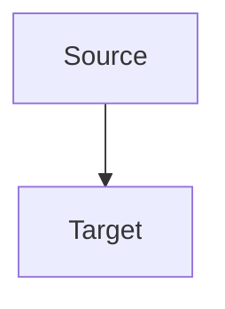

# Docs Workflow

CANarchy publishes its full documentation site from the same repository as the codebase using `mkdocs-material` and GitHub Pages.

## Local Preview

Install the docs toolchain:

```bash
uv sync --group docs
```

Run the local docs server:

```bash
uv run mkdocs serve
```

Build the full GitHub Pages site locally:

```bash
bash scripts/build_pages_site.sh
```

This produces:

* `site/index.html` as the custom GitHub Pages landing page from the repository-root `index.html`
* `site/docs/` as the MkDocs-built documentation site

## Source Layout

The docs site pulls from these in-repo sources:

* repository-root `index.html` for the GitHub Pages landing page
* `docs/index.md` for the docs landing page published at `/docs/`
* `README.md` surfaced through `docs/overview.md`
* `AGENTS.md` surfaced through `docs/agents.md`
* `docs/architecture.md`, `docs/command_spec.md`, and `docs/tui_plan.md` as direct site pages

This keeps the hosted docs aligned with the current repository state while avoiding a second docs-only repo.

## Mermaid Diagrams

The docs site supports Mermaid code fences for architecture and flow diagrams.

Use standard Mermaid fenced blocks:

```text

```

Mermaid rendering is configured in `mkdocs.yml` and initialized by `docs/javascripts/mermaid.js`.

The site theme also supports light and dark mode through Material for MkDocs, following system preferences by default and allowing manual toggling in the site header. Mermaid diagrams derive their theme from the active site palette.

## GitHub Pages

The GitHub Pages workflow builds the full Pages artifact on pushes to `main` and deploys the generated `site/` directory through GitHub Pages.

The published structure is:

* `/` for the custom homepage
* `/docs/` for the MkDocs documentation site

If the Pages site is not yet enabled in the repository settings, enable GitHub Pages with GitHub Actions as the source.
