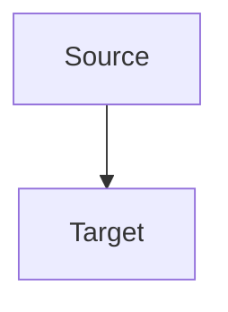

# Docs Workflow

CANarchy publishes its full documentation site from the same repository as the codebase using `mkdocs-material` and GitHub Pages.

## Local Preview

Install the docs toolchain:

```bash
uv sync --group docs
```

Run the local docs server:

```bash
uv run mkdocs serve
```

Build the full GitHub Pages site locally:

```bash
bash scripts/build_pages_site.sh
```

This produces:

* `site/index.html` as the custom GitHub Pages landing page built from `src/homepage/index.html` and `src/homepage/site.css`
* `site/docs/` as the MkDocs-built documentation site

## Source Layout

The docs site pulls from these in-repo sources:

* `src/homepage/index.html` and `src/homepage/site.css` for the GitHub Pages landing page
* `docs/index.md` for the docs landing page published at `/docs/`
* `README.md` surfaced through `docs/overview.md`
* `AGENTS.md` surfaced through `docs/agents.md`
* `docs/architecture.md`, `docs/command_spec.md`, and `docs/tui_plan.md` as direct site pages

This keeps the hosted docs aligned with the current repository state while avoiding a second docs-only repo.

## Landing Page

The landing page is static HTML and CSS with no build step. Its content must be
present in the HTML payload itself: crawlers that do not execute JavaScript, and
every social scraper, never see script-rendered markup. `scripts/build_pages_site.sh`
fails the build if the published page loses that content or picks up a
browser-side framework or compiler, and `tests/test_homepage.py` asserts the same
from the source file.

Client-side scripting is limited to the mobile navigation toggle and the
`pip install` copy button; both are progressive enhancements over markup that
works without them. Responsive behaviour lives in media queries in
`src/homepage/site.css`, which uses the breakpoints 1100px (desktop), 760px
(tablet), 430px, and 390px. Update the release version and issue tag in the hero
and install sections of `src/homepage/index.html` on each release.

## Page Metadata and Social Cards

Every user-facing page carries its own meta description in front matter:

```yaml
---
description: "One sentence describing what this page does, under 200 characters."
---
```

Without it `mkdocs-material` falls back to the site-wide `site_description`,
which would give every page the same meta description and the same social-card
text. `tests/test_docs_metadata.py` fails if a user-facing page is missing one
or reuses another page's wording, so a new cookbook recipe or tutorial needs a
description in the same commit.

The built-in `social` plugin renders a card per page from the page title and
that description, so a shared docs URL unfurls with page-specific text. Card
generation needs the imaging dependencies:

```bash
uv sync --group docs                      # includes mkdocs-material[imaging]
sudo apt-get install -y libcairo2-dev libfreetype6-dev libffi-dev \
  libjpeg-dev libpng-dev libz-dev         # or the equivalent for your OS
```

On a cold cache the plugin downloads its font from Google Fonts, so the first
build needs network access. Rendered cards and the font are cached under
`.cache/plugin/social`, which the docs workflow restores between runs.

## Internal Pages

`docs/design/`, `docs/tests/`, and `docs/benchmarks/` are internal
specification and record pages. They stay published and stay in the site's own
search, but they are kept out of the crawl surface so search engines weigh the
site by its guides, tutorials, and cookbook instead of ~100 spec pages:

* `overrides/sitemap.xml` omits them from the sitemap
* `overrides/main.html` marks them `noindex, follow`

Those two lists must stay in step; the test above checks that both cover every
prefix. Pages under these directories do not need a `description:` entry.

## Mermaid Diagrams

The docs site supports Mermaid code fences for architecture and flow diagrams.

Use standard Mermaid fenced blocks:

```text

```mermaid
flowchart TD
  A[Source] --> B[Target]
```
```

Mermaid rendering is configured in `mkdocs.yml` and initialized by `docs/javascripts/mermaid.js`.

The site theme also supports light and dark mode through Material for MkDocs, following system preferences by default and allowing manual toggling in the site header. Mermaid diagrams derive their theme from the active site palette.

## GitHub Pages

The GitHub Pages workflow builds the full Pages artifact on pushes to `main` and deploys the generated `site/` directory through GitHub Pages.

The published structure is:

* `/` for the custom homepage
* `/docs/` for the MkDocs documentation site

If the Pages site is not yet enabled in the repository settings, enable GitHub Pages with GitHub Actions as the source.
